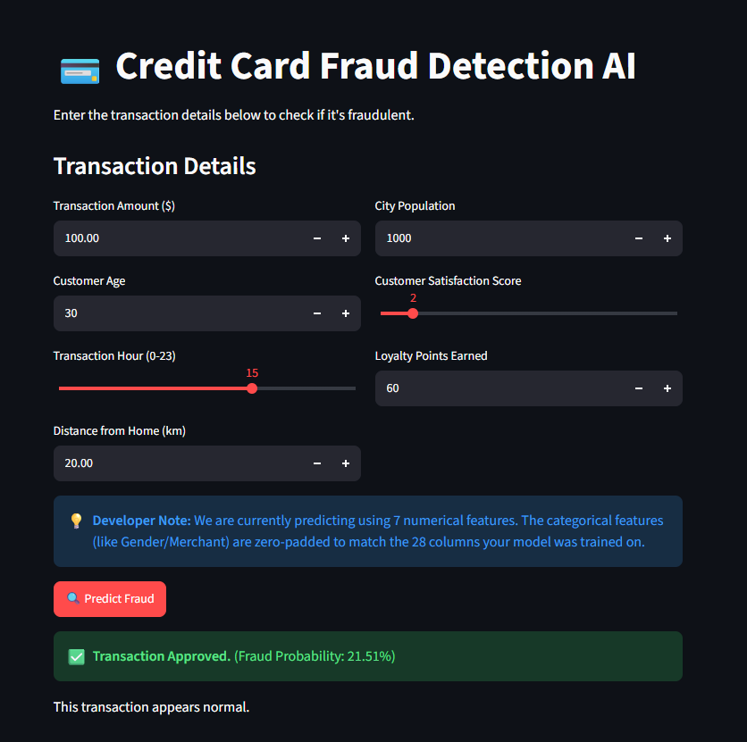

# Credit Card Fraud Detection (Deep Learning)




## Overview
This is a Deep Learning project built with TensorFlow/Keras to detect fraudulent credit card transactions. Credit card fraud datasets are notoriously imbalanced (usually containing less than 1% actual fraud). This project focuses on building a Neural Network that can effectively identify fraudulent patterns without being overwhelmed by the majority "normal" class.

## Methodology & Feature Engineering
To make the model effective, several data preprocessing and feature engineering steps were implemented:
* **Geospatial Analysis:** Used the Haversine formula to calculate the physical distance between the customer's home and the merchant location.
* **Temporal Analysis:** Extracted the specific hour of the transaction to catch late-night fraudulent activity.
* **Handling Class Imbalance:** Since over 99% of the dataset consists of normal transactions, the model was trained using **Class Weights**. This heavily penalizes the AI for missing a fraudulent transaction, resulting in a significantly higher Recall score (catching 76%+ of actual frauds).
* **Data Scaling:** Applied `StandardScaler` to normalize the input data so the neural network converges efficiently.

## Technology Stack
* **Deep Learning Framework:** TensorFlow & Keras (Sequential API)
* **Data Processing:** Pandas, NumPy, Scikit-Learn
* **Model Serialization:** Joblib (for the scaler) and Keras (for the model weights)
* **User Interface:** Streamlit

## How to Run the App
This project includes a web-based User Interface built with Streamlit that allows you to enter transaction details and get a real-time AI prediction.

1. Install the required dependencies:
```bash
pip install -r requirements.txt
```

2. Run the Streamlit application:
```bash
streamlit run app.py
```

3. Open the provided `localhost` URL in your browser to interact with the model!
